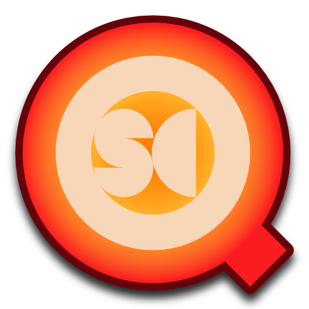

This repository contains a framework, some test apps, and several user-facing utilities that all implement the OSCQuery protocol.

The OSCQuery protocol defines a way for machines to query the properties of [OSC](http://www.opensoundcontrol.org/) servers and their address spaces over a network connection.  The point of this protocol is to allow clients to browse the various available OSC nodes that an application responds to, and query the properties of these nodes to determine what kind of data they expect and how best to interact with them.

The proposal itself is small, relatively simple, and is posted here: https://github.com/mrRay/OSCQueryProposal

This repository contains a number of different targets:
* **VVOSCQueryProtocol.framework** is a Cocoa framework that provides classes which can be used to implement this protocol in software that already has an existing OSC implementation- it does so in a simple, generic and library-agnostic fashion.  By itself, this framework does *NOT* send or receive OSC data, nor does it provide classes to let you create an OSC address space- this is all functionality that has already been implemented in a variety of other OSC libraries.  Instead, this framework gives you the tools you need to add support for the OSCQuery protocol to whatever OSC implementation you're already working with.
* **Utilities for Users**
    * **OSCQuery Browser** is a GUI that lets you browse the contents of OSCQuery servers on the local network and send data to the various OSC nodes.
    * **OSCQuery Helper** is a Cocoa app that lets you add OSCQuery support to other applications that already support OSC, but do not yet support OSCQuery.
    * **MIDI OSCQuery Helper** is a Cocoa app that lets you add OSCQuery support to other applications that support MIDI, but do not yet support OSC or OSCQuery.
* **Utilities for Developers**
    * **VVOSCQueryServer** is a Cocoa app that demonstrates the basics of creating an OSCQuery server that works with an existing OSC library.  It's basically a sandbox app for demonstrating and experimenting with server functionality- out of the box, it loads a JSON file that populate an OSC address space, starts an OSC + OSCQuery server
    * **VVOSCQueryClient** is a Cocoa app that demonstrates minimal client functionality, listing the available OSCQuery servers detected on a local network.  Like the test server, this is basically a sandbox app for demonstrating and experimenting with client functionality.

**Dependencies:**

VVOSCQueryProtocol uses [websocketpp](https://github.com/zaphoyd/websocketpp) and [rapidjson](https://github.com/Tencent/rapidjson), and websocketpp uses [asio](https://think-async.com/).  All three reposistories are included as submodules, and if you check everything out the xcode project file should "just work".

**How to use VVOSCQueryProtocol in your project:**

VVOSCQueryProtocol is a framework: it contains a dynamic library and all the headers you need to compile and link against that library.  Briefly, here's how you add this framework to an existing project in XCode:
- Add VVOSCQueryProtocol.xcodeproj to your xcode workspace (drag it into the xcode project file).
- Add VVOSCQueryProtocol.framework as a dependency to your target (select your target, click "Build Phases", expand the "Target Dependencies" section, and add VVOSCQueryProtocol.framework).
- Link against VVOSCQueryProtocol.framework (select your target, click "Build Phases", expand the "Link Library with Libraries" section, and add VVOSCQueryProtocol.framework).
- Ensure that VVOSCQueryProtocol.framework is embedded in the compiled application- (make a "Copy Files" build phase, configure it to copy to the "Frameworks" subdirectory, and add the framework to this build phase).

**Documentation:**

The API for VVOSCQueryProtocol.framework is minimal, and the header files are clean and have a high signal to noise ratio- there are only two main classes (client & server!), and VVOSCQueryProtocol.h does a good job of introducing them and giving you a quick overview.  Fancier documentation is coming soon...
